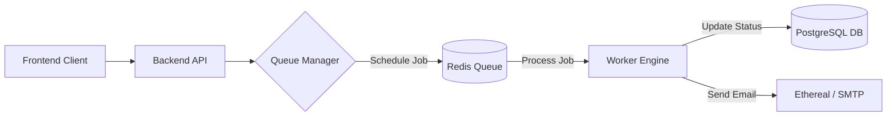

# Reach D. Box - Distributed Email Scheduler

A production-grade distributed system that schedules and sends emails at scale with guaranteed delivery and fault tolerance.
When the server crashes or rate limits are hit, the system automatically persists jobs and resumes processing without data loss.

This project demonstrates an end-to-end, fault-tolerant scheduling architecture suitable for high-throughput production environments.

---

## Overview

This system combines precise job scheduling, distributed queue management, concurrency control, and a visual dashboard into a single cohesive workflow.

**Core capabilities:**

- Precision scheduling without Cron jobs

- Persistence across server restarts (Crash Recovery)

- Automatic rate limiting and concurrency management

- Real-time status tracking via Dashboard

---

## System Architecture


---

## Key Features

**Distributed Scheduling Engine**

- Decoupled architecture using BullMQ and Redis

- Jobs are stored as:

    - `delayed` (waiting for time)

    - `active` (processing)

    - `completed` / `failed`

- Metadata stored in PostgreSQL for permanent record-keeping

**Fault Tolerance & Persistence**

- Crash Recovery: Redis AOF/RDB persistence ensures jobs survive server failure

- Auto-Resume: Workers automatically reconnect and process pending jobs on restart

- Idempotency: Database status checks prevent duplicate sends

**Rate Limiting & Concurrency**

- Enforces strict provider limits (e.g., 50 emails/hour)

- Token Bucket Algorithm: Automatically queues excess jobs for the next window

- Worker Concurrency: Configured to process 5 jobs simultaneously to manage load

**Smart Fallback System**

- Ethereal Email: Used for simulation

- Offline Mode: Automatically switches to JSON logging if external SMTP APIs go down

- Ensures the system never crashes due to third-party failures

---

## Project Structure

```
├── backend/
│   ├── src/
│   │   ├── jobs/               # BullMQ Worker and Queue logic
│   │   ├── controllers/        # API logic for scheduling
│   │   ├── config/             # Redis, Mailer, and DB configuration
│   │   └── routes/             # Express API routes
│   ├── prisma/                 # Database Schema (PostgreSQL)
│   ├── docker-compose.yml      # Infrastructure (Redis + Postgres)
│   └── .env
├── frontend/
│   ├── src/
│   │   ├── app/dashboard/      # Main Dashboard UI
│   │   ├── api/auth/           # NextAuth.js (Google OAuth)
│   │   └── lib/                # API Client
│   ├── .env.local
│   └── tailwind.config.ts
└── README.md
```

---

## Setup Instructions

1. Install Dependencies

Backend:
```
cd backend
npm install
```

Frontend:
```
cd frontend
npm install
```

2. Start Infrastructure

Start Redis and PostgreSQL containers:
```
cd backend
docker-compose up -d
npx prisma generate && npx prisma db push
```

3. Run the Application

Start Backend (Port 4000):
```
npm run dev
```

Start Frontend (Port 3000):
```
cd frontend
npm run dev
```

---

## Simulating the Workflow

1. Open `http://localhost:3000` and login via Google

2. Click Compose Email

3. Select a time 2 minutes in the future and click Schedule

4. The Crash Test:

    - Immediately stop the Backend server (Ctrl + C)

    - Wait for 1 minute
 
    - Restart the Backend (npm run dev)

5. Observe the terminal: The worker wakes up, finds the pending job from Redis, and sends it.

The system self-heals and ensures the email is delivered despite the downtime.

---

## Dashboard Features

- Google OAuth Authentication

- Live "Scheduled" vs "Sent" status monitoring

- Compose Modal with Date/Time picker

- Real-time updates on job completion

- Visual indicators for success/failure

--- 

## Tech Stack

| Category | Technology | Purpose |
|--------|------------|---------|
| Frontend | React | Dashboard UI |
| Styling | Tailwind CSS | Utility-first styling |
| Backend | Node.js | Server runtime |
| Queue | BullMQ | Background job scheduling |
| Cache | Redis | State store & message broker |
| Database | PostgreSQL | Relational storage |
| Auth | OAuth 2.0 | Secure authentication |

---

## Use Cases

- Transactional email systems (Password resets, Order confirmations)

- Marketing campaign schedulers

- Reminder and notification services

- High-throughput message queues

---

## Future Improvements

- AWS SES / SendGrid integration

- Recurring jobs (Cron-style repetition)

- Webhook notifications on job failure

- Multi-tenancy support for different organizations

- Slack alerts for system downtime